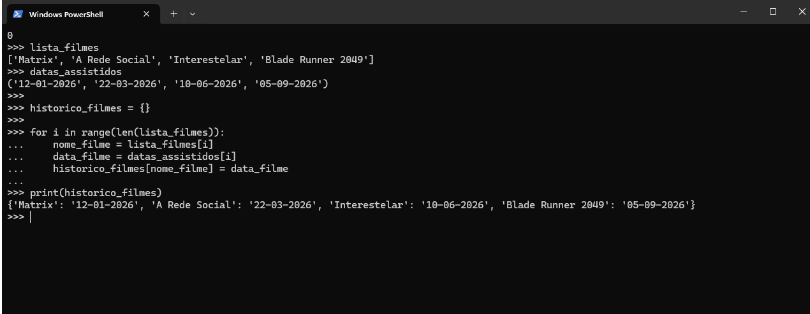

# 🐍 Exercício Prático: Estruturas de Dados em Python

Este laboratório documenta a resolução de um exercício focado na manipulação de Listas, Tuplas e Dicionários em Python.

## 🚀 O que foi feito
* **Lista (`[]`):** Armazenamento dos nomes dos filmes (dados mutáveis).
* **Tupla (`()`):** Armazenamento das datas de visualização (dados imutáveis).
* **Dicionário (`{}`):** Associação final mapeando cada filme (Chave) à sua respectiva data (Valor) usando um laço `for`.

## 📸 Evidência de Execução

