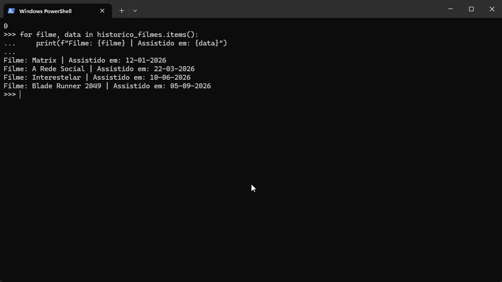

# 🐍 Exercício Prático: Estruturas de Dados e Laços em Python

Este laboratório documenta a resolução de uma atividade prática focada no gerenciamento, associação e iteração de estruturas de dados básicas em Python (Listas, Tuplas e Dicionários).

## 🚀 O que foi realizado

1. **Criação de Estruturas Base:**
   * **Lista (`[]`):** Armazenamento ordenado e mutável dos nomes dos filmes favoritos.
   * **Tupla (`()`):** Armazenamento imutável das datas de visualização para preservar a integridade histórica do registro.

2. **Construção do Dicionário (`{}`):**
   * Implementação de um laço `for` estruturado para associar cada filme (Chave) à sua respectiva data (Valor).

3. **Iteração e Leitura de Dados (`.items()`):**
   * Criação de um segundo laço utilizando o método `.items()` para percorrer o dicionário e imprimir de forma amigável as chaves e valores combinados na tela.

---

## 🔍 Erros Identificados e Corrigidos (Aprendizado Prático)

* **NameError (Variáveis Inexistentes):** Ajuste de erros de digitação comuns no terminal interativo, como a confusão entre o plural `nome_filmes` e o singular `nome_filme`, e a palavra `fime` sem a letra "l".
* **AttributeError (`.item` vs `.items()`):** Correção do método de leitura do dicionário. O Python exige o uso do termo no plural (`.items()`) para desempacotar chaves e valores simultaneamente.

---

## 📸 Evidências Visuais de Execução

### Etapa 1: Criação e Geração do Dicionário

### Etapa 2: Execução do Loop com .items()

---

## 🛠️ Tecnologias
* Python 3 (Terminal Interativo CLI)
* VS Code & Extensão Markdown
* Git & GitHub
