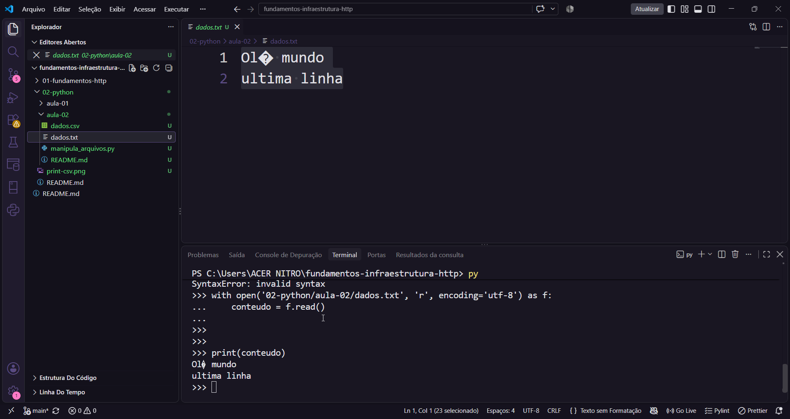
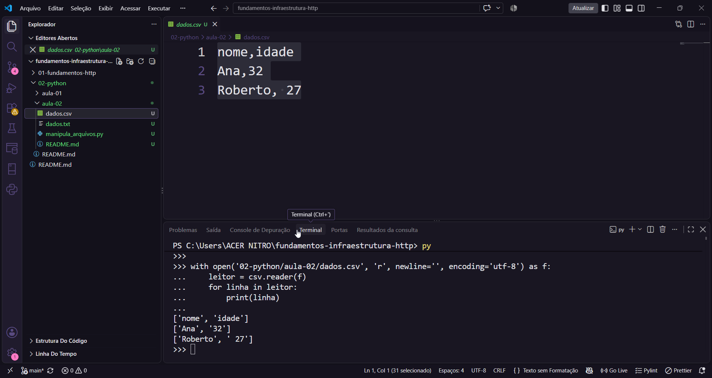
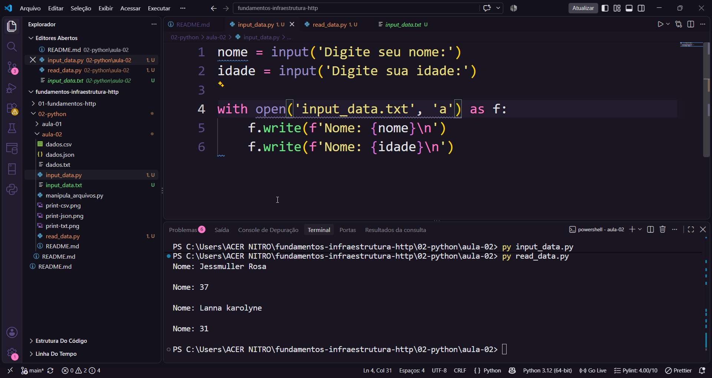
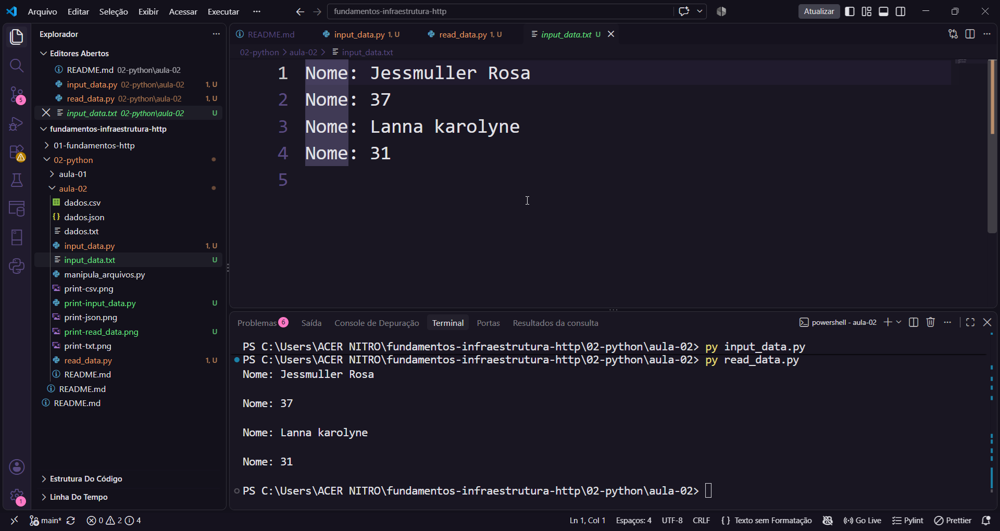

# 📁 Aula 02: Manipulação e Persistência de Arquivos (TXT, CSV, JSON e Inputs)

Este laboratório foi dedicado à prática de persistência, estruturação e manipulação de dados em arquivos locais utilizando funções nativas, capturas dinâmicas do usuário e bibliotecas integradas do Python.

## 🚀 O que foi explorado:
* **Entrada e Saída de Dados:** Manipulação segura de arquivos utilizando o gerenciador de contexto `with open()`.
* **Arquivos TXT Básicos:** Escrita e leitura estruturada de strings em blocos de texto puro com tratamento de codificação (`utf-8`).
* **Arquivos CSV:** Uso da biblioteca integrada `import csv` para ler e processar dados estruturados no formato tabular (linhas e colunas).
* **Arquivos JSON:** Uso da biblioteca integrada `import json` para realizar a serialização e deserialização de dicionários usando `json.dump()` e `json.load()`.
* **Captura Dinâmica (`input()`) & Modo Append (`'a'`):** Criação de scripts interativos (`input_data.py`) para receber dados do usuário via terminal e salvá-los de forma incremental, adicionando novas linhas ao final do documento sem sobrescrever os registros anteriores.
* **Leitura Linha por Linha:** Utilização do script `read_data.py` com estruturas de repetição `for` para varrer e exibir arquivos de texto de maneira automatizada.

---

## 🔍 Aprendizados Práticos & Resolução de Erros

* **Erros de Sintaxe no Modo Interativo:** Entendimento de que blocos que abrem escopo executados direto no terminal (`>>>`) exigem uma linha vazia (Enter duplo) para fechar o bloco antes de chamar outras funções.
* **Caminhos de Arquivos (Paths):** Compreensão de que declarar apenas o nome do arquivo faz o Python criá-lo na raiz global. Para salvar de forma organizada dentro do projeto, deve-se explicitar a árvore de diretórios.

---

## 📸 Evidências Práticas de Execução

### 1. Arquivo de Texto Tradicional (.txt)

### 2. Tabela de Dados (.csv)

### 3. Estruturas de Dados (.json)

### 4. Código do Script de Captura (input_data.py)

### 5. Arquivo Gerado via Interação com Usuário (input_data.txt)

### 6. Leitura Automatizada com Laço de Repetição (read_data.py)

