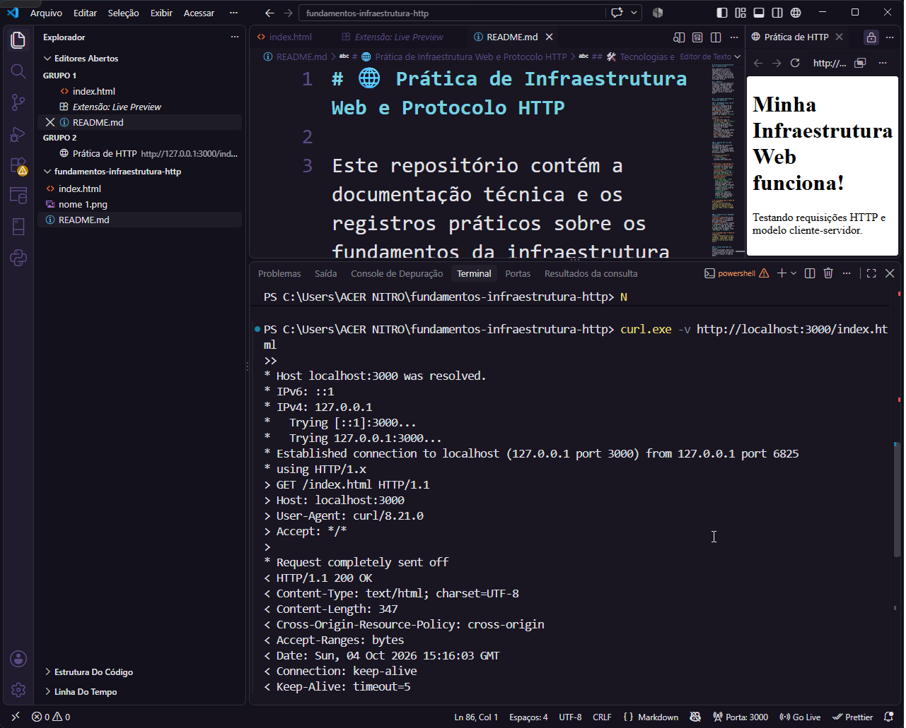
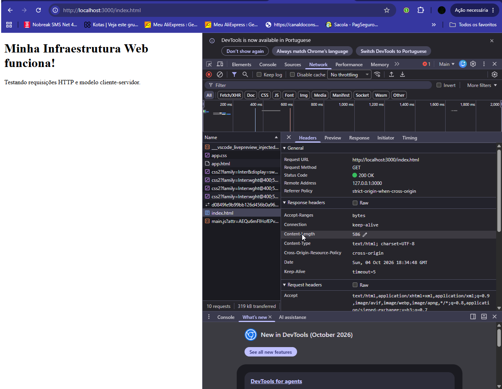

# 🌐 Prática de Infraestrutura Web e Protocolo HTTP

Este repositório contém a documentação técnica e os registros práticos sobre os fundamentos da infraestrutura web, o modelo cliente-servidor e o funcionamento do protocolo HTTP, realizados como parte das atividades da aula.

## 🚀 Objetivo
Explorar o ciclo de requisição e resposta (Request/Response), inspecionar tráfego de rede utilizando ferramentas como cURL, DevTools e Postman, e compreender as diferenças entre métodos, portas e cabeçalhos HTTP.

---

## 🛠️ Atividades Realizadas & Evidências Realistas

### 1. Hospedagem Local com VS Code Live Preview
* **Ação:** Configuração da extensão Live Preview no VS Code para servir um arquivo HTML simples localmente.
* **Resultado:** O arquivo foi hospedado com sucesso no endereço de loopback (`127.0.0.1`).
* **Porta Local vs Portas Padrão:** 
  * A aplicação rodou na **porta local 3000** (`http://127.0.0.1:3000`), que é utilizada em ambiente de desenvolvimento para evitar conflitos no sistema operacional.
  * Diferente das portas padrão do tráfego web mundial: **Porta 80** (utilizada para HTTP inseguro) e **Porta 443** (utilizada para HTTPS seguro e criptografado).

---

### 2. Requisições via cURL (Terminal)
Foi realizada uma requisição detalhada utilizando a ferramenta de linha de comando `curl.exe` no PowerShell para analisar o comportamento direto do protocolo HTTP.

* **Comando executado:**
  ```powershell
  curl.exe -v http://localhost:3000/index.html
  ```

* **Métricas e Logs Obtidos:**
  * **Conexão estabelecida:** Conectado com sucesso ao IP `127.0.0.1` na porta `3000`.
  * **Versão do HTTP identificada:** `HTTP/1.1` (conforme indicado no log `> GET /index.html HTTP/1.1`).
  * **Cabeçalhos de Resposta (Response Headers) Identificados:**
    * `Content-Type`: `text/html; charset=UTF-8`
    * `Content-Length`: `347`



---

### 3. Inspeção com o Navegador (DevTools)
* **Ação:** Utilização da aba **Network (Rede)** do DevTools para monitorar o carregamento da página localmente e analisar os cabeçalhos de requisição e resposta.
* **Observações:** Foi validado o recebimento do Status Code `200 OK`, o tempo de resposta e os cabeçalhos como o `Content-Type` e `Content-Length: 586` injetados dinamicamente pelo ecossistema do Live Preview.



---

### 4. Testes Avançados com Postman
Foram estruturadas requisições dentro do Postman para analisar o comportamento de servidores externos e simular tráfego de dados do modelo cliente-servidor:

* **Requisição GET (`https://alura.com.br`):** Enviada uma requisição GET para capturar a estrutura base da plataforma, retornando o código fonte HTML completo da Alura com o Status `200 OK`.


---

## 📚 Guia de Referência: Métodos HTTP

Abaixo estão listados os principais métodos HTTP estudados e documentados para fins de consulta técnica:

| Método | Descrição | Idempotente? | Possui Body? |
| :--- | :--- | :---: | :---: |
| **GET** | Solicita a representação de um recurso específico. Apenas recupera dados. | Sim | Não |
| **POST** | Envia dados para o servidor, geralmente para criar um novo recurso ou submeter um formulário. | Não | Sim |
| **PUT** | Substitui todas as atuais representações do recurso alvo com os dados da requisição (Atualização total). | Sim | Sim |
| **PATCH** | Aplica modificações parciais a um recurso (Atualização parcial). | Não | Sim |
| **DELETE** | Exclui o recurso especificado do servidor. | Sim | Não |

---

## 🛠️ Tecnologias e Ferramentas Utilizadas
* **VS Code** (com extensão Live Preview desenvolvida pela Microsoft)
* **cURL.exe** (nativo do Windows via PowerShell)
* **Google Chrome DevTools**
* **Postman**
* **Git & GitHub**
